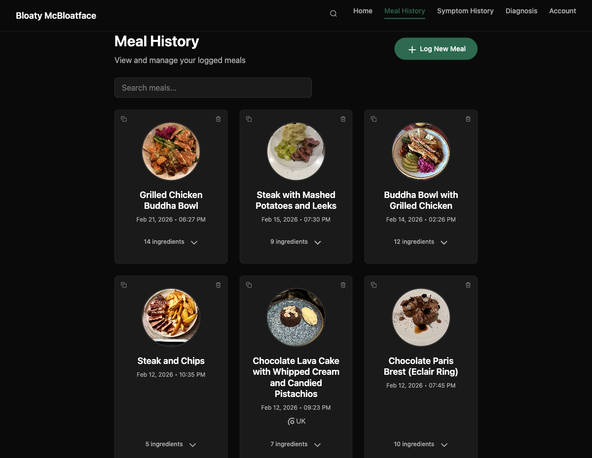
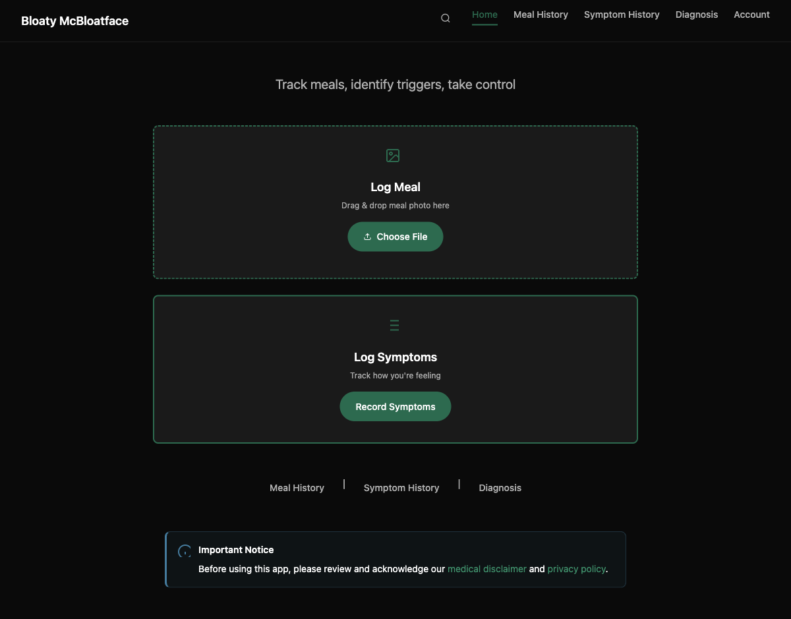
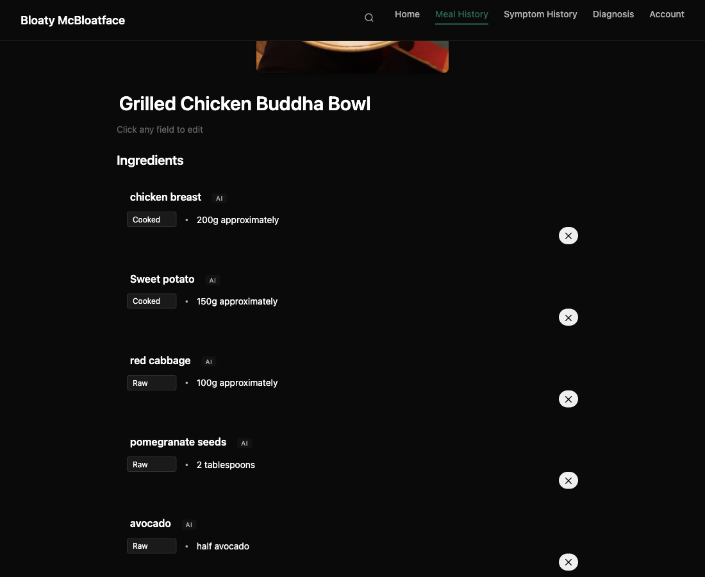
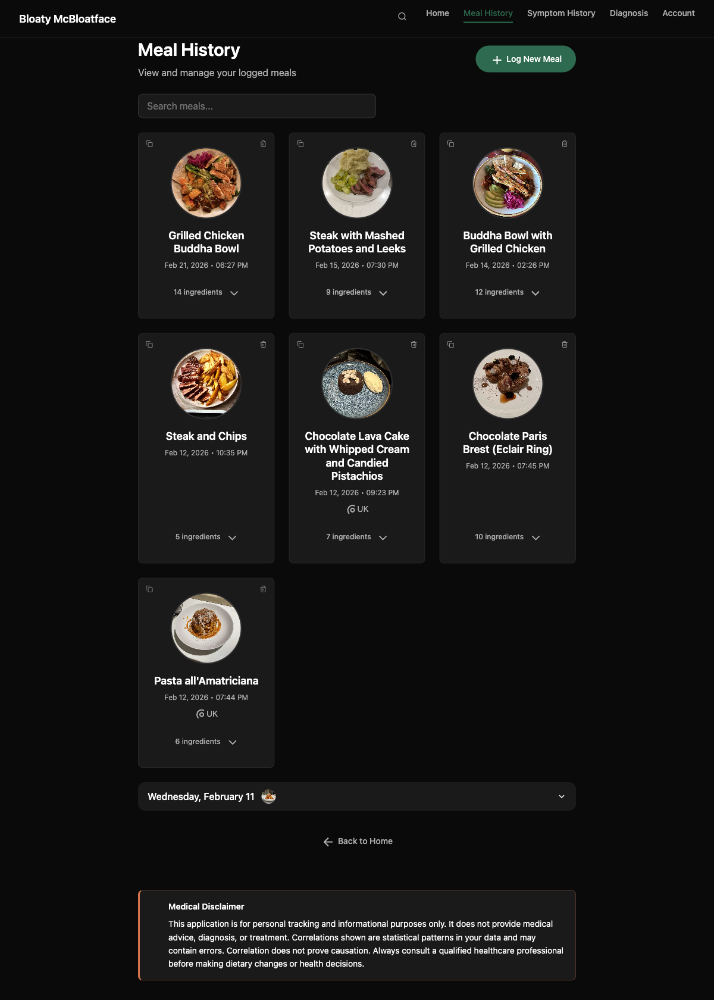
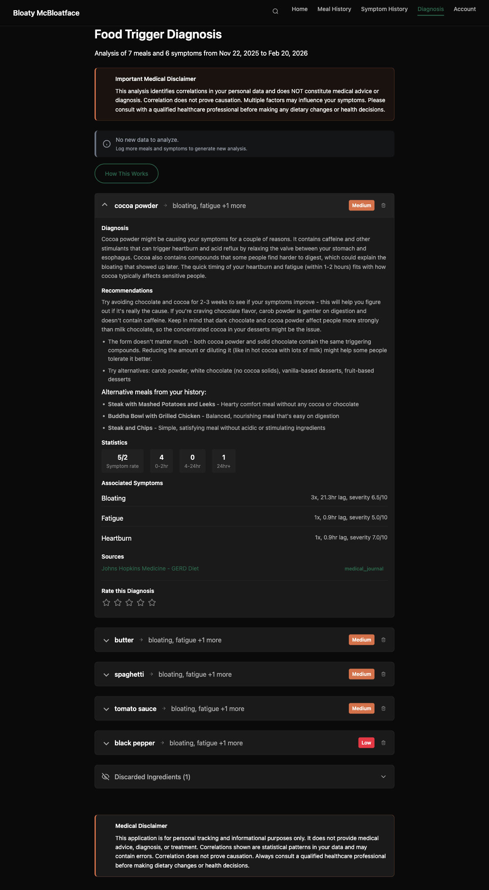
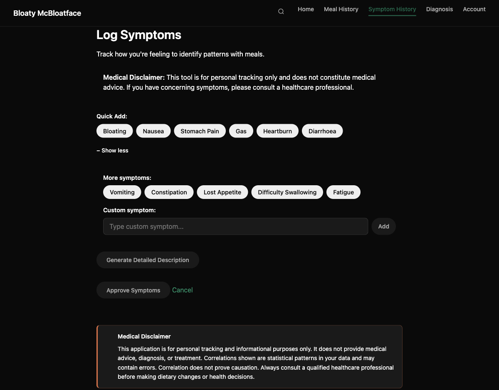
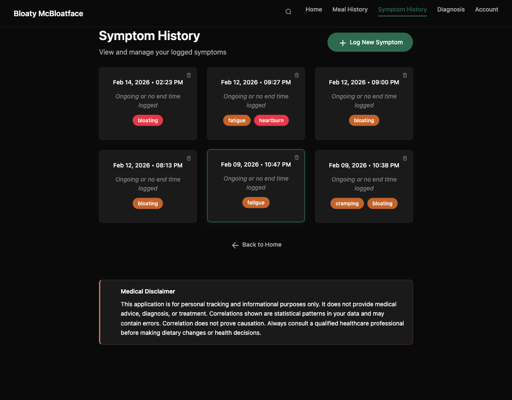
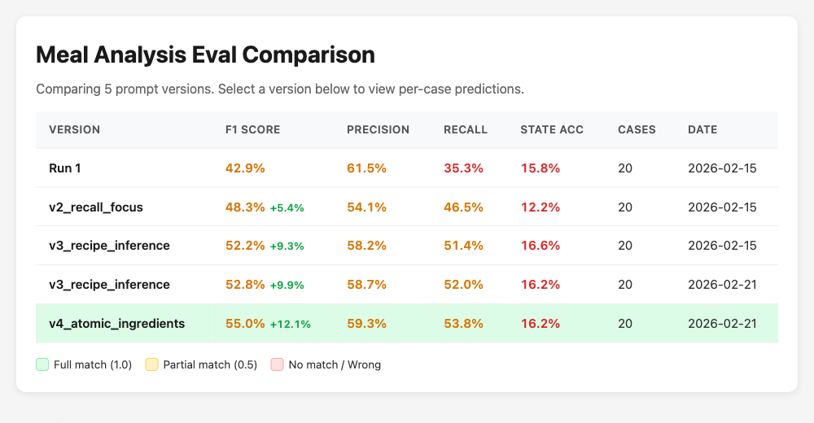

# Bloaty McBloatface

**A production web app for meal tracking and food trigger diagnosis, built with human direction and AI implementation via [Claude Code](https://docs.anthropic.com/en/docs/claude-code).**

<p align="center">
  <code>100% AI-coded</code>&nbsp;&nbsp;&middot;&nbsp;&nbsp;<code>~90% MVP</code>&nbsp;&nbsp;&middot;&nbsp;&nbsp;<code>~27k lines of code</code>&nbsp;&nbsp;&middot;&nbsp;&nbsp;<code>~$0.60/user/month AI cost</code>
  <br>
  <code>Live at bloaty-app.com</code>&nbsp;&nbsp;&middot;&nbsp;&nbsp;<code>Deployed in &lt;16hrs</code>
</p>

<p align="center">
  
</p>

---

## Contents

| Section | Key Insight |
|---------|------------|
| [The Premise](#the-premise) | Origin story: from idea to deployed web app in two weeks of evenings |
| [Lessons Learned](#lessons-learned) | Where human + coding agent development excels, and where it struggles |
| [UI & Features](#ui--features) | Dark-themed design system with AI-powered meal analysis and symptom tracking |
| [Architecture](#architecture--key-design-decisions) | No frontend framework: htmx + Alpine.js for full interactivity without build tools |
| [AI Integration](#ai-integration) | 3-stage async diagnosis pipeline with medical grounding and citation system |
| [Evals](#evals--prompt-engineering) | Iterative prompt engineering: F1 0.429 → 0.550 (+28.2% from baseline) |
| [Agentic Workflow](#agentic-workflow) | Federated CLAUDE.md + docs structure as persistent agent memory across sessions |
| [Testing](#testing-strategy) | 771 tests, 95% coverage, transaction rollback pattern; no test database needed |
| [Local DevOps](#local-devops) | Local CI checks, pre-commit hooks, and automated agentic bug-fixing before code reaches remote |
| [Security](#security) | Seven layers of defence from TLS termination through to AI response schema validation |
| [DevOps & AWS](#devops--aws) | Single EC2 instance running five containers for ~$20/month |

---

## The Premise

Someone suggested it would be cool to have an AI-driven app to help diagnose gastrointestinal distress from food images and logged symptoms. The premise: build this as a proper, deployed web application using [Claude Code](https://docs.anthropic.com/en/docs/claude-code) with 100% agentic coding. The user sets direction, strategy, and desired outcomes; the coding agent proposes technical options and implements everything.

Two weeks of evenings later, that person is using the app from a live web domain. Every line of code (Python, HTML, CSS, SQL migrations, Docker configuration, shell scripts, nginx config, CI pipelines) was authored by Claude Code across ~120 commits. Rapid development of personalised software is here!

---

## Lessons Learned

### What worked well

- **Human-Machine development.** Human-led design and decision-making, orchestrating multiple parallel development agents implementing the system. Over time custom skills were developed to accelerate automation (git worktree skill and utility script) and secure-by-design skill including a security-audit CLI.
- **Federated documentation as agent memory.** The CLAUDE.md + specialised docs pattern gave the coding agent reliable context without overloading the context window. STATUS.md as a session journal was particularly effective for continuity.
- **Recursive prompt engineering with evals.** The coding agent could hypothesise, implement a prompt variant, run evals, analyse results, and iterate, all within a single session. The v1-to-v4 progression happened naturally.
- **Infrastructure-as-code mindset.** Docker, nginx config, Alembic migrations, CI pipelines, deploy scripts: the coding agent handled all of these fluently. Containerised environments are a natural fit for agentic development.
- **Test-driven verification.** Having the coding agent write tests and run them in-loop caught regressions immediately. The transaction rollback pattern emerged organically from the agent suggesting it. This includes Playwright MCP allowing the coding agent to self-fix (most) UI issues.

### What was harder than expected

- **CSS and visual design.** Getting the dark theme right required the user providing reference screenshots and iterating extensively. The coding agent needed concrete visual examples, not just descriptions. The DESIGN_PRINCIPLES.md document was born from this friction.
- **Jinja2 + Alpine.js escaping.** A subtle bug where Jinja2's `|tojson` filter conflicted with HTML attribute parsing took multiple sessions to diagnose. The solution (initialising data in `<script>` tags) is now documented as a pattern in DESIGN_PRINCIPLES.md to prevent recurrence.
- **SVG icon sizing.** CSS classes alone don't scale SVG content from external sprite references; explicit `width`, `height`, and `viewBox` attributes are required. Another pattern that had to be discovered, documented, and enforced.
- **False positive correlations.** The diagnosis feature identifies statistical correlations, but correlation is not causation. Ingredients frequently eaten together (chicken + rice) show similar patterns even if only one is a trigger. This remains an open problem.
- **Security blind spots.** The coding agent occasionally introduced security issues (e.g. overly permissive CORS, missing input validation) that the user caught during review. Having a human in the loop for security-sensitive decisions proved essential.

### Implications

Agent-authored software is production-viable for web applications of this complexity. The key enabler is setting up feedback loops, not the coding agent's ability. Tests, linters, type checkers, evals, and CI pipelines give the agent the same guardrails that make human developers effective and enabled recursive verification and self-improvement. The documentation-as-memory pattern suggests that agentic development benefits from the same engineering practices we already know work: write things down, automate verification, and make the implicit explicit.

---

## UI, Features

### Design-by-Example

Initially the agent produced an emoji-rich Notion-esque design, which needed improvement! Not having time or access to proper design tools, a custom dark theme was developed by the user providing reference style-guides from apps like Linear, VSCO, and Slite with custom design concepts. The coding agent then captured the resulting design decisions in `DESIGN_PRINCIPLES.md`, a living style guide that it consults when implementing any UI change. The 60/30/10 colour palette (dark/forest green/terracotta), typography scale, and component specifications all emerged from this process.

<table>
<tr>
<td width="50%">

**Home page.** Drag-and-drop a meal photo or record symptoms in two taps.


</td>
<td width="50%">

**Meal analysis.** AI-detected ingredients with state tracking (raw/cooked/processed) and estimated quantities, editable by the user.


</td>
</tr>
<tr>
<td width="50%">

**Meal history.** Meal thumbnails with expandable ingredient lists are searchable and are grouped by day except for the most recently recorded.


</td>
<td width="50%">

**Diagnosis.** Ingredient-level trigger analysis with medical citations, confounder detection, and plain-English recommendations.


</td>
</tr>
<tr>
<td width="50%">

**Symptom logging.** Tag-based entry with quick-add pills for common symptoms and severity sliders.


</td>
<td width="50%">

**Symptom history.** Severity-coded cards with colour-coded tags for at-a-glance review.


</td>
</tr>
</table>

---

## Architecture & Key Design Decisions

The design and decision-making was human-led via free-text in the terminal, with the coding agent proposing implementation options and executing all of the development.

Five containers orchestrated via Docker Compose:

```
Client (Browser)
     |  HTTP / SSE
     v
   nginx (:443)     Static files, TLS termination, security headers
     |
   FastAPI (:8000)  ------>  PostgreSQL (:5432)
     |
   Redis (:6379)  <------  Dramatiq Worker
```

| Decision | Chose | Over | Why |
|----------|-------|------|-----|
| Frontend | htmx + Alpine.js | React / Vue | No build tools, SSR-first, ~10KB total JS |
| Task queue | Dramatiq | Celery | Simpler API, Redis-native broker, fewer dependencies |
| Real-time updates | SSE | WebSockets | Diagnosis progress is unidirectional; SSE auto-reconnects and works through proxies |
| Auth pattern | Strategy pattern | Hardcoded local auth | `AuthProvider` interface allows swapping to Keycloak/OAuth without touching routes |
| Testing | Transaction rollback | Separate test DB | Each test runs in a transaction that rolls back; no cleanup, no test database |
| AI responses | Pydantic schema + retry | Raw JSON parsing | Validation failure feeds error context back to model for corrected response |

<details>
<summary>Application layer architecture (click to expand)</summary>

```
Routes (app/api/)         7 router modules: HTTP handlers, auth, HTML responses
  |
Services (app/services/)  Business logic, AI integration, orchestration
  |
Models (app/models/)      18 SQLAlchemy models with self-referential relationships
  |
PostgreSQL                16 Alembic migrations applied
```

Key services: `ClaudeService` (all AI interactions), `DiagnosisService` (temporal correlation analysis), `SSEPublisher` (Redis pub/sub for real-time progress), `AuthProvider` (pluggable auth strategy).

See [docs/ARCHITECTURE.md](docs/ARCHITECTURE.md) for the full guide.

</details>

---

## AI Integration

Each suspected trigger ingredient passes through a three-stage pipeline: research the medical science, classify whether it is a true cause or a confounder, then translate the findings into plain English.

### The 3-Stage Diagnosis Pipeline

Each ingredient is analysed independently through an async pipeline, enabling parallelism and granular real-time progress via SSE:

```
Input: ingredient correlation data + user meal history
  |
  v
Stage 1: research_ingredient()
  |  Web search enabled; returns medical assessment + citations (NIH, PubMed)
  v
Stage 2: classify_root_cause()
  |  Determines root cause vs confounder (e.g. chicken eaten alongside the actual trigger)
  |
  +-- Confounder --> discard with justification --> done
  |
  v
Stage 3: adapt_to_plain_english()
  |  Technical diagnosis → user-friendly language with actionable recommendations
  v
Output: DiagnosisResult + citations --> publish SSE event to browser
```

### Structured Output

Every AI response is validated against a typed Pydantic schema. On validation failure, the error context is fed back to the model for a corrected response (`_call_with_schema_retry` pattern). Key schemas: `MealAnalysisSchema`, `RootCauseSchema`, `ResearchIngredientSchema`, `SingleIngredientDiagnosisSchema`.

### Cost Tracking

Every API call is logged to `AIUsageLog` with model, token counts, cached token rate (10% of normal), and estimated cost. Monthly estimate per active user:

| Feature | Usage | Cost |
|---------|-------|------|
| Meal analysis | ~60 meals | $0.18 |
| Symptom elaboration | ~30 symptoms | $0.09–0.30 |
| Diagnosis runs | ~4 runs | $0.07 |
| **Total** | | **~$0.60/month** |

<details>
<summary>Prompt caching strategy (click to expand)</summary>

Diagnosis uses `build_cached_analysis_context()` to reuse the system prompt and meal history across per-ingredient calls, reducing input token costs by ~90% on cached runs. First diagnosis run: ~$0.05; subsequent cached runs: ~$0.005.

</details>

---

## Evals & Prompt Engineering

The coding agent scraped 53 recipes from BBC Good Food, built a ground-truth dataset, then iterated on the meal analysis prompt three times to improve F1 by 28.2%.

### Dataset

Scraped 53 recipes from BBC Good Food with images and full ingredient lists. Ground truth includes ingredients not visible in photos (stock, garlic, seasoning), which shaped the entire prompt iteration strategy.

### Iterative Improvement

Once the eval dataset was captured and the initial prompt baseline, the coding agent was prompted to review the results and propose hypotheses for improving the performance through prompt engineering. This led to a pattern of recursive improvement, with the agent setting a hypothesis based on prior results, re-running the eval, and repeating.

A key breakthrough was that ground truth images/recipes include invisible ingredients (onion, garlic, stock) that no vision model can detect from a photo. Prompting the model to infer typical recipe ingredients based on the identified dish type was the key unlock for recall.



<sub>Custom-built HTML dashboard comparing per-image performance across prompt versions</sub>

### LLM-as-Judge

Uses Haiku as a judge to provide soft scores (0, 0.5, 1.0) for ingredient matching. Handles semantic equivalence ("ground beef" matches "minced beef" at 1.0, "cheddar cheese" matches "cheese" at 0.5) that string matching misses entirely.

See [docs/EVALS_STRATEGY.md](docs/EVALS_STRATEGY.md) for the full eval framework including diagnosis evals.

---

## Agentic Workflow

Early on, it was decided that key information such as delivery status and design principles should be captured in stand-alone documents. However, while Claude Code's memory persisted across sessions through structured documentation files, each time the chat was cleared (e.g. new session or new plan) it would lose track of these documents and begin repeating old mistakes or duplicating information. A more structured approach was needed.

### CLAUDE.md as Agent Memory

The `CLAUDE.md` file at the project root acts as the coding agent's persistent instruction set, loaded into context at the start of every session. Rather than duplicating detail, it references specialised docs:

```
CLAUDE.md (always loaded)
  |-- docs/ARCHITECTURE.md     System design, component interactions
  |-- docs/DESIGN_PRINCIPLES.md UI/UX design system, Alpine.js/Jinja2 patterns
  |-- docs/TESTING.md           Test patterns, database isolation, CI
  |-- docs/SECURITY.md          Auth patterns, OWASP checklist, PR security review
  |-- docs/DEVOPS.md            AWS deployment, infrastructure
  |-- docs/EVALS_STRATEGY.md    AI evaluation framework, metrics, datasets
  |-- docs/STATUS.md            Implementation progress (updated each session)
```

This federated structure means the coding agent loads only the high-level context by default, with deep dives available via file reads when needed. `CLAUDE.md` tells the agent *what to reference when*, not *everything it needs to know*.

### Session Continuity

`STATUS.md` serves as the coding agent's session-to-session memory. At the end of each session, the agent updates the "Last Updated" date, moves completed items, and records what to prioritise next. The next session starts by reading this file to understand current state.

---

## Testing Strategy

Every test runs inside a database transaction that rolls back automatically, so there is no test database to manage and no cleanup between tests.

**771 tests across 28 files, 95% coverage.**

Test categories: unit tests (model/service logic), integration tests (API endpoints, template rendering), and security tests (SQL injection, XSS, CSRF, path traversal, access control). Linting further assures high code quality.

```bash
# All tests run inside Docker (required for database access)
docker compose exec web pytest tests/ -v
docker compose exec web ruff check .
docker compose exec web ruff format --check .
```

CI runs on every push: ruff check + ruff format + pytest with coverage enforcement.

See [docs/TESTING.md](docs/TESTING.md) for patterns and merge workflow.

---

## Local DevOps

As coding agents are reliable for longer time-horizon tasks, they can work locally in parallel directed by the user as an agentic dev-team. Running CI checks locally after each merge is faster than pushing and waiting for GitHub Actions, and lets the coding agent fix failures before code ever reaches remote.

### Git Worktree + Docker Port Isolation

For parallel development (multiple Claude Code sessions working simultaneously), the project uses git worktrees with automatic Docker port allocation to avoid network clashes on the same machine. A custom local Claude Code skill (`gwt-docker`) with bash-script 'CLI' detects the worktree name and assigns unique port ranges per worktree, preventing container conflicts. The skill allows the coding agent to maintain the associated 'local DevOps' design patterns in the project.

### Agent-Driven Testing Discipline

Testing is currently instructed through agent documentation. `CLAUDE.md` directs the coding agent to run the full test suite, linter, and formatter before considering any work complete, and `docs/TESTING.md` requires test coverage before merging to main. When tests fail, the coding agent fixes the issues in-loop, so broken code should never reach GitHub.

### Containerised Development

All code runs inside Docker. Tests, linting, and formatting all execute via `docker compose exec web` to match the production environment exactly. The `docker-entrypoint.sh` handles permissions, and the web container includes hot-reload for development. A deploy/docker-compose.prod.yml is layered on top for deploying the app (on AWS only), overwriting some configuration settings for the production setting.

---

## Security

Seven layers of defence from TLS termination through to AI response schema validation, with the user catching issues the coding agent introduced along the way. A `secure-design` skill was developed for assured design of this project and future projects, including a custom `security-audit` CLI that can runs standard open-source tools to audit the code. This returns stdout codes, so can be integrated into CI pipelines.

| Layer | Implementation |
|-------|---------------|
| TLS | Let's Encrypt via nginx, auto-renewed with webroot method |
| Auth | Session-based, bcrypt hashing, invite-only registration |
| CSRF | Origin/Referer validation middleware (automatic for all state-changing requests) |
| XSS | Jinja2 autoescaping, Alpine.js data via `<script>` tags with `\|tojson` |
| SQL injection | SQLAlchemy ORM only; zero raw SQL in the codebase |
| File uploads | Content-type whitelist, server-generated filenames, nginx extension checks |
| AI responses | Pydantic schema validation, no `\|safe` on AI output, no code execution |
| Headers | X-Frame-Options, X-Content-Type-Options, Referrer-Policy via nginx |
| Scanning | `/security-audit` Claude Code skill (gitleaks, bandit, semgrep, trivy) |

Public security docs: [docs/SECURITY.md](docs/SECURITY.md). Operational details live in `SECURITY_INTERNAL.md` (gitignored).

---

## DevOps & AWS

A single EC2 instance runs all five containers for about $20/month, with manual deploys via EC2 Instance Connect while fully automated CI/CD remains a TODO. The app is ready to horizontally scale if needed, with web servers (FastAPI) and analysis workers (Dramatiq) duplicating based on demand.

The user set up AWS infrastructure manually. The coding agent handled Docker configuration, nginx setup, deploy scripts, and backup automation.

```
Internet --> Route 53 --> EC2 (t3.small)
                           |-- nginx (:443/:80)  <-- Let's Encrypt
                           |-- FastAPI (:8000)
                           |-- Dramatiq worker
                           |-- PostgreSQL
                           |-- Redis

                        EBS Volume (persistent data)
Daily backup --> S3 bucket (pg_dump + uploads)
```

| Resource | Cost |
|----------|------|
| EC2 t3.small | ~$15/mo |
| EBS 20GB gp3 | ~$2/mo |
| Route 53 | ~$0.50/mo |
| S3 backups | ~$0.50/mo |
| Domain | ~$1/mo |
| **Total** | **~$20–25/mo** |

Secrets managed via AWS Secrets Manager (`bloaty/production` secret containing API key, session key, DB password, and S3 bucket name), fetched at deploy time. The EC2 instance uses an IAM role (`bloaty-ec2-role`) with minimal permissions: Secrets Manager read-only and S3 write-only for backups. The instance can write backups but cannot read them, limiting blast radius if compromised.

Currently deploys via EC2 Instance Connect. Full CI/CD pipeline end-to-end is a TODO.

Automated daily backups at 3 AM to S3 with 90-day lifecycle. GitHub Actions CI pipeline on every push.

See [docs/DEVOPS.md](docs/DEVOPS.md) for the full deployment guide.

---

## Project Structure

```
bloaty-mcbloatface/
|-- app/                  Python application (API, services, models, templates)
|-- alembic/              Database migrations (16 applied)
|-- deploy/               Production scripts, Docker Compose overrides
|-- docs/                 Architecture, design, security, devops, evals, status
|-- evals/                AI evaluation framework, scrapers, datasets, prompts
|-- nginx/                Reverse proxy configuration
|-- scripts/              Utility scripts (eval reports, etc.)
|-- tests/                Unit, integration, and security tests
|-- docker-compose.yml    Container orchestration
|-- CLAUDE.md             Agent instruction set
```

### Quick Start

```bash
git clone https://github.com/twm105/bloaty-mcbloatface.git
cd bloaty-mcbloatface
cp deploy/.env.example .env        # Add your ANTHROPIC_API_KEY
docker compose up -d
docker compose exec web alembic upgrade head
# Open http://localhost:8000
```

---

## Metrics

| Metric | Value |
|--------|-------|
| Lines of Python | 20,215 |
| Lines of HTML | 5,914 |
| Lines of CSS | 1,677 |
| Total source files | 212 |
| Git commits | 119 |
| Database migrations | 16 |
| SQLAlchemy models | 18 |
| Test functions | 771 |
| Test coverage | 95% |
| Eval dataset | 53 recipes (BBC Good Food) |
| Best eval F1 | 0.550 (+28.2% from baseline) |
| AI cost/user/month | ~$0.60 |
| Infrastructure cost/month | ~$20–25 |

---

## Contributing

This is a personal project, but suggestions welcome via issues.

## License

[PolyForm Noncommercial 1.0.0](LICENSE). Free to view, fork, and learn from. Commercial use is not permitted.
